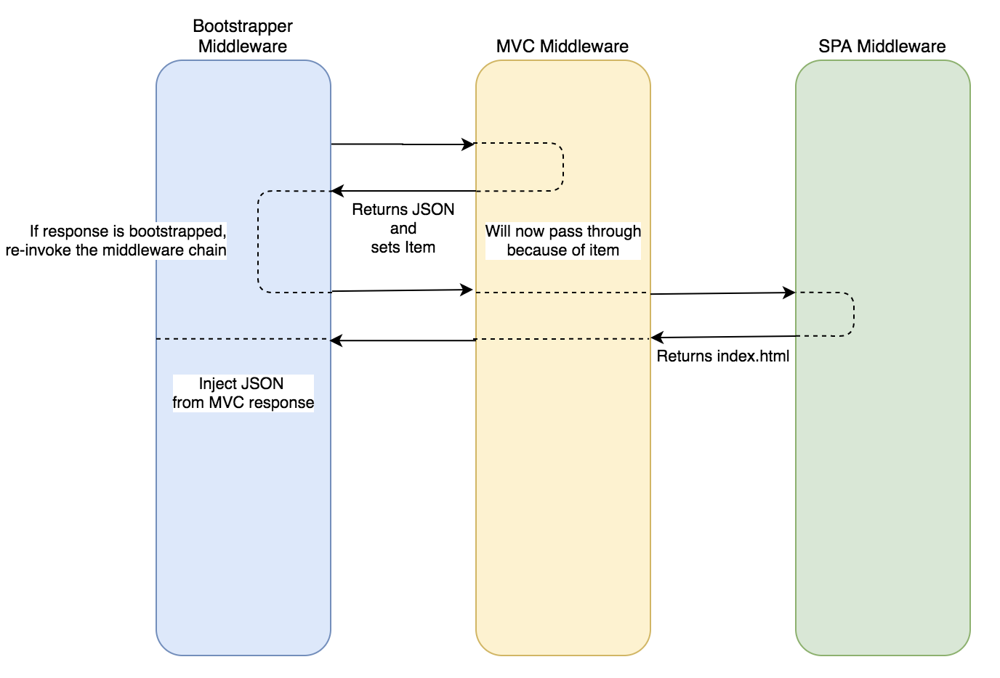

## Bootstrapping in .NET and SPA

### Goals:
- Provide a way for the backend to inject additional data on a page served by the SPA middleware
- Keep the server code consitent with existing practices

Where the issue comes up in this setup is that MVC is a terminal middleware (meaning if a route is defined, the response will end in MVC by default). The recommended pattern for setting up a Spa middleware is:

```csharp
void Configure()
{
    app.UseMvc();
    app.UseSpa(spa => {
        ...
    });
}
```

So the only way to actually get to the Spa middleware is for the MVC middleware to think it has no work to do. This becomes a problem when we want to define some paths that can provide additional data to the page. In order to do that, we need a few things

1) A middleware before MVC that allows us to control the invocation on MVC. In our case, we are going to invoke it, look for an identifier from the response and if we see it, invoke the next middlewares again ([BootstrappingMiddleware](/src/BootstrappingMiddleware/Bootstrapping/BootstrappingMiddleware.cs))
2) An attribute for an MVC route ([BootstrappedDataAttribute](/src/BootstrappingMiddleware/Bootstrapping/BootstrappedDataAttribute.cs)) that will 
   1) Inject an identifier into the context to indicate this is a bootstrap route
   2) If the action is invoked again, indicate to MVC that it cannot handle the request
3) A wrapper around the response stream that will only write to the stream if it knows it should. Much of this was discovered and called out in [this article about content injection](https://weblog.west-wind.com/posts/2020/Mar/29/Content-Injection-with-Response-Rewriting-in-ASPNET-Core-3x) ([ResponseStreamWrapper](/src/BootstrappingMiddleware/Bootstrapping/ResponseStreamWrapper.cs))

Now, our middleware setup becomes
```csharp
void Configure()
{
    app.UseMiddleware<BoostrappingMiddleware>();
    app.UseMvc();
    app.UseSpa(spa => {
        ...
    });
}
```
and out MVC route will look like
```csharp
[BootstrappedData("/")]
public object BootstrapHome()
{
    return new
    {
        Example = "ConfigValue",
    };
}
```

